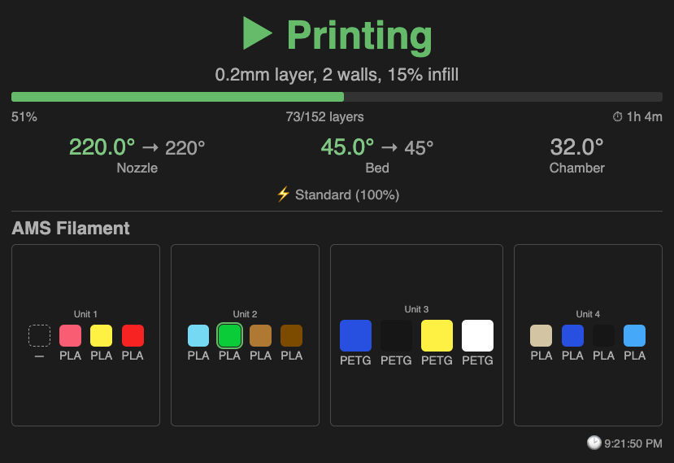

# Bambu Lab → Hubitat Integration

Monitor your Bambu Lab 3D printer from a Hubitat Elevation dashboard. Live status tiles show print progress, temperatures, filament state, and AMS contents — all updated in real time directly from the printer's local MQTT broker. No extra hardware, no Docker, no bridge device required.



---

## How it works

```
Printer (LAN MQTT) → Hubitat driver (MQTT client) → Dashboard tiles
```

The driver opens a direct TLS connection to the printer's on-board MQTT broker (port 8883), authenticating with your LAN access code. The companion app serves the visual dashboard tile pages and handles notifications and automations.

Everything runs over your local network. "LAN Only Mode" does not need to be enabled — the MQTT broker is always accessible on the LAN. Remote access and the Bambu Handy app are unaffected.

---

## Components

| File | Purpose |
|---|---|
| `bambu-printer.groovy` | Hubitat device driver — MQTT client, parses printer telemetry, exposes all attributes |
| `bambu-lab-app.groovy` | Hubitat app — dashboard tile serving (via OAuth), notifications, automations |

---

## Setup

### 1. Find your printer credentials

Before installing anything, collect these from your printer's touchscreen:

| Value | Where to find it |
|---|---|
| **IP Address** | Touchscreen: Settings → Network. Recommended: reserve a static DHCP lease in your router so the address doesn't change. |
| **Serial Number** | Touchscreen: Settings → Device Info. Also shown in Bambu Studio on the Device tab. |
| **LAN Access Code** | Touchscreen: Settings → Network (eight-character code below the IP address). |

### 2. Install the driver and app

**Via Hubitat Package Manager (recommended):** search for **Bambu Lab Printer** and install. Both components are installed in one step.

**Manual install:**

1. In Hubitat, go to **Drivers Code** → **+ New Driver** → **Import**
   Paste: `https://raw.githubusercontent.com/brossow/hubitat-drivers/main/bambu-lab/bambu-printer.groovy`
2. Go to **Apps Code** → **+ New App** → **Import**
   Paste: `https://raw.githubusercontent.com/brossow/hubitat-drivers/main/bambu-lab/bambu-lab-app.groovy`
3. **Important:** on the Apps Code page for Bambu Lab Printer, click **OAuth** → **Enable OAuth** — required for dashboard tiles

### 3. Create the device

1. Go to **Devices** → **Add Device** → **Virtual**
2. Give it a name (e.g. "Bambu X1C")
3. Set **Type** to **Bambu Lab Printer** (namespace: brossow)
4. Click **Create Device**
5. In **Preferences**, fill in your printer's IP address, serial number, and LAN access code
6. Click **Save Preferences** — the driver connects immediately

If the connection succeeds, `connectionStatus` will show **connected** in Current States within a few seconds.

### 4. Install the app

1. Go to **Apps** → **+ Add User App** → **Bambu Lab Printer**
2. Select the printer device you created
3. Configure tile appearance, notifications, and automations as desired
4. Click **Done**

### 5. Add the dashboard tile

1. Open or create a Hubitat dashboard
2. Add an **Attribute** tile:
   - Device: your Bambu Lab Printer device
   - Attribute: **`html`** — combined status + AMS tile
3. Give the tile plenty of vertical space — portrait orientation (taller than wide) works well
4. **Recommended:** in dashboard settings → **Templates** → **Attribute** → **default** state → set **Background Color** transparency to 0. This lets the tile's own background show through. (Affects all Attribute tiles on that dashboard.)

Optionally, add a second **Attribute** tile using attribute **`htmlAms`** for a standalone AMS filament tile — useful for wide layouts.

---

## App settings

### Tile Appearance

**Color theme:**
- **Dark** (default) — calibrated for dark dashboard backgrounds (~#1C1C1C)
- **Light** — calibrated for light dashboard backgrounds (~#F8F8F8)

Both themes meet WCAG AA contrast standards.

**Show AMS filament section in combined tile** — when enabled (default), the `html` tile shows printer status on top and AMS filament below. Auto-hides if no AMS data is reported by the printer.

**AMS tile columns:**
- **Auto** (default) — browser fits as many columns as tile width allows (min 160px per unit)
- **1–4, 6, 8, 12** — fixed column count; capped at the number of AMS units present

### Notifications

Configure which events trigger push notifications. Notifications are sent to any Hubitat-compatible notification device (e.g. the Hubitat mobile app).

| Trigger | Default |
|---|---|
| Print finished (includes filename and elapsed time) | On |
| Print started | Off |
| Print paused | Off |
| Printer error | On |
| Filament type changed | Off |
| Progress milestones (25 / 50 / 75 / 90 %) | Off |

### Automations

Control switches and dimmers based on printer events. An optional **hub mode restriction** limits automations to specific modes.

| Event | Actions available |
|---|---|
| Print starts | Turn switches ON / OFF |
| Print finishes | Turn switches ON / OFF; set dimmers to a level |
| Printer error | Turn switches ON |

---

## Dashboard tile details

### Combined tile (`html` attribute)

Shows:
- **Printer state** — Idle / Preparing / Printing / Paused / Finished / Failed, color-coded
- **File name** — the print job name
- **Progress bar** — percentage, layer count, elapsed time, and estimated time remaining
- **Temperatures** — nozzle, bed, and chamber. Color-coded: neutral when idle, amber when heating, green when at target
- **Speed + filament** — current speed profile and magnitude, plus active filament type with color swatch (shown during active prints)
- **AMS section** — all filament units with color swatches, material types, and remaining percentages; active tray highlighted (when enabled and AMS data available)
- **Connection indicator** — small dot in the footer showing MQTT connection state
- **Timestamp** — last data received, displayed in your local timezone
- **Auto-refresh** — tile reloads every 30 seconds automatically

### AMS-only tile (`htmlAms` attribute)

Same AMS content, served independently. Useful for wide layouts with status and filament on separate tiles side by side.

---

## Device attributes

All attributes are exposed as standard Hubitat device state and available in Rule Machine, automations, and additional dashboard tiles.

| Attribute | Type | Description |
|---|---|---|
| `connectionStatus` | string | `connected` · `disconnected` |
| `printerState` | string | `IDLE` · `PREPARE` · `RUNNING` · `PAUSE` · `FINISH` · `FAILED` |
| `printFile` | string | Current print job filename |
| `printProgress` | number | Progress 0–100% |
| `printElapsed` | string | Elapsed print time (H:MM:SS, tracked locally) |
| `remainingTime` | number | Estimated minutes remaining |
| `currentLayer` | number | Current layer number |
| `totalLayers` | number | Total layer count |
| `nozzleTemp` | number | Nozzle temperature (°C) |
| `nozzleTargetTemp` | number | Nozzle target temperature (°C) |
| `bedTemp` | number | Bed temperature (°C) |
| `bedTargetTemp` | number | Bed target temperature (°C) |
| `chamberTemp` | number | Chamber temperature (°C) |
| `speedLevel` | string | Speed profile: Quiet · Standard · Sport · Ludicrous |
| `speedMagnitude` | number | Speed percentage |
| `filamentType` | string | Active tray material (e.g. PLA, PETG) |
| `filamentColor` | string | Active tray color (#RRGGBB) |
| `amsSummary` | string | Compact AMS summary (e.g. `A0T0:PLA/FF0000/75%`) |
| `amsTrayNow` | number | Active tray global index (255 = none / external spool) |
| `chamberLight` | string | Chamber light state: `on` · `off` (read-only) |
| `printError` | string | Error code (`"0"` = no error) |
| `wifiSignal` | string | WiFi signal strength |
| `cameraUrl` | string | RTSP stream URL |
| `lastUpdate` | string | ISO-8601 UTC timestamp of last MQTT data |
| `html` | string | iframe stub for the combined dashboard tile |
| `htmlAms` | string | iframe stub for the standalone AMS tile |
| `driverVersion` | string | Installed driver version |

---

## Troubleshooting

**Device shows `connectionStatus: disconnected` immediately after saving**
- Verify the printer IP address is correct and that the hub can reach it (try pinging from a device on the same network)
- Double-check the LAN access code — transcription errors are common; re-copy it from the touchscreen
- Ensure nothing on your network is blocking TCP port 8883 between the hub and the printer
- Turn on **Debug Logging** in device preferences and review the Hubitat live log for the specific error message

**Driver connects but status never updates / attributes stay stale**
- Newer Bambu firmware may send only delta payloads rather than full state; the driver compensates by requesting a full push on the refresh schedule
- If attributes are slow to populate, lower the **Status Refresh Interval** to 60 seconds in device preferences
- The driver watches for prolonged silence from the printer and triggers an automatic full reconnect when it detects a stale connection

**Dashboard tiles are blank when viewing remotely**
- The tile `src` URLs point to your hub's local IP. They only load when your browser can reach that address directly — on your local network, or over a VPN. Hubitat cloud dashboard relay will show blank iframes. This is a known limitation of the iframe tile architecture.

**Dashboard tile shows "Please select an attribute"**
- Set the tile attribute to `html` (not a state or other attribute)

**Hubitat app page shows no OAuth tiles / tiles don't load**
- OAuth must be enabled: Apps Code → Bambu Lab Printer → OAuth → Enable OAuth → Save
- Reinstall the app (remove and re-add) to regenerate the access token if needed

**AMS section not appearing**
- Confirm "Show AMS filament section" is enabled in app settings
- AMS data is included in the MQTT payload automatically when an AMS is connected
- Click **Refresh** on the device page to request a full status push

**Direct SSL connection doesn't work on my hub**
- Use the optional MQTT relay: set up a local Mosquitto broker that relays the printer topic, then configure **MQTT Relay Host** and **MQTT Relay Port** in device preferences

---

## Compatibility

- **Tested on:** Bambu Lab X1C
- **Expected to work:** X1, P1S, P1P, A1, A1 Mini — same MQTT protocol
- **AMS Lite:** untested but expected to work (reports through the same MQTT fields)
- **Multiple AMS units:** supported, up to 12 (the hardware maximum)
- **Multi-nozzle printers** (X2D, H2D): single-nozzle display only in v1; contributions welcome once those payload formats are documented

---

## Support

If this integration saves you some time or makes your workflow better, a small donation via [PayPal](https://paypal.me/brossow) is always appreciated — though never expected.

---

## License

MIT
