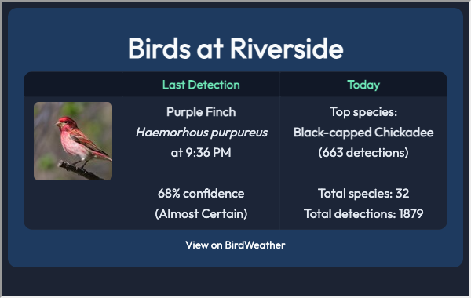

# BirdWeather PUC — Hubitat Driver

By [Brent Rossow](https://github.com/brossow). Integrates your [BirdWeather PUC](https://www.birdweather.com) station with Hubitat Elevation, exposing live bird detections as device attributes and events for use in automations and dashboards.

> **You don't even need your own station** — the driver works with any public BirdWeather station. Browse the map at [app.birdweather.com](https://app.birdweather.com) to find one near you.

## Installation

1. In Hubitat, go to **Drivers Code → New Driver**
2. Paste the contents of `birdweather-puc.groovy` and click **Save**
3. Go to **Devices → Add Device → Virtual**, name it (e.g. "Backyard Birds"), and select **BirdWeather PUC** as the driver
4. Open the device and enter your **Station ID** in Preferences → **Save Preferences**
5. Click **Refresh** once to verify the connection — scheduled polling starts automatically

### Finding Your Station ID

Your Station ID is the number in the URL when viewing your station at [app.birdweather.com](https://app.birdweather.com) — e.g. `app.birdweather.com/stations/25574` → Station ID is `25574`. You can also find it in the BirdWeather app under your station's settings.

You don't need to use your own station — any public BirdWeather station works. Follow a local nature center, a favorite birding spot, or just the most active station in your area.

### API Token (optional)

The longer API Token shown under Advanced Settings in the BirdWeather app is only needed for **private stations**. Leave it blank for public stations.

## Attributes

| Attribute | Description |
|-----------|-------------|
| `lastSpecies` | Common name of the most recently detected bird |
| `lastSpeciesScientific` | Scientific name |
| `lastConfidence` | Detection confidence (0–100 %) |
| `lastCertainty` | `Almost Certain` / `Very Likely` / `Uncertain` / `Unlikely` |
| `lastDetectedAt` | ISO 8601 timestamp of the detection |
| `lastDetectedTime` | Display-friendly local time of the detection (e.g. `10:47 AM`) |
| `lastSpeciesImageUrl` | Thumbnail URL for the species |
| `lastSoundscapeUrl` | URL of the audio clip that triggered the detection |
| `recentDetections` | JSON array of the last N detections (configurable) |
| `todaySpeciesList` | JSON array of all species names detected today |
| `todaySpecies` | Number of unique species detected today |
| `todayDetections` | Total detection count today |
| `topSpeciesToday` | Most-detected species today |
| `topSpeciesCount` | Detection count for the top species |
| `totalSpecies` | All-time unique species count |
| `totalDetections` | All-time detection count |
| `birdDetected` | Trigger attribute — updates on every new detection |
| `newSpeciesDetected` | Trigger attribute — updates when a new species is seen today |
| `lastPollStatus` | `OK` or an error message |
| `lastPollTime` | Timestamp of the last successful poll |

## Events

Two events fire in the device event log and can be used as Rule Machine triggers:

- **`birdDetected`** — fires on every new detection; `value` = common name  
  `descriptionText` example: *American Robin detected (94%, almost_certain)*
- **`newSpeciesDetected`** — fires the first time a species is seen each day; `value` = common name  
  `descriptionText` example: *First American Robin sighting today! (Turdus migratorius)*

The daily species list resets at midnight in your hub's time zone.

## Preferences

| Setting | Description |
|---------|-------------|
| **Station ID** | Numeric ID from your station's URL at app.birdweather.com |
| **API Token** | Optional — only needed for private stations |
| **Poll Interval** | How often to check for new detections (1–30 min) |
| **Recent Detections to Track** | Depth of the `recentDetections` JSON history (3–20) |
| **Minimum Confidence %** | Ignore detections below this threshold (0 = accept all) |
| **Fire events only for certainty level ≥** | Filter `birdDetected`/`newSpeciesDetected` events by BirdWeather's certainty label |
| **Pause polling at night** | Skip polls between sunset and sunrise |
| **Enable Debug Logging** | Verbose logging in the hub's log viewer |

## Automation Ideas

**Announce every detection on a speaker:**
> Rule Machine → Trigger: `birdDetected` changes →  
> Action: Speak "%lastSpecies% detected in the backyard" on [speaker device]

**Push notification for a new species:**
> Rule Machine → Trigger: `newSpeciesDetected` changes →  
> Action: Send push "New bird today: %value% (%lastSpeciesScientific%)"

**Flash a light on a rare/high-confidence sighting:**
> Rule Machine → Trigger: `birdDetected` changes  
> Condition: `lastCertainty` = `Almost Certain`  
> Action: Flash [light device] 3 times

**Dashboard tile:**  
Add `lastSpecies`, `todaySpecies`, and `todayDetections` as tiles using the Attribute template. For a richer display — species photo, detection time, and today's stats in a single tile — see [Tile Builder Grid](#tile-builder-grid) below.

## Tile Builder Grid

[Tile Builder](https://community.hubitat.com/t/release-tile-builder-build-beautiful-dashboards/118822) by @garyjmilne can display all of this driver's data in a single rich dashboard tile — species photo, last detection details, and today's summary side by side. The Grid layout (which enables multi-column tiles) requires a license ($12 minimum donation, unlocked in the Tile Builder app).

See the [community forum post](https://community.hubitat.com/t/release-birdweather-puc-driver/163303) for a complete style example including the variable layout, override CSS, and setup notes.

## API Reference

This driver uses the [BirdWeather REST API](https://app.birdweather.com/api/v1):

| Endpoint | Used for |
|----------|----------|
| `GET /stations/{token}/detections` | Latest detection + recent history |
| `GET /stations/{token}/stats?period=day` | Today's species and detection counts |
| `GET /stations/{token}/species?period=day` | Top species + all-time totals |
