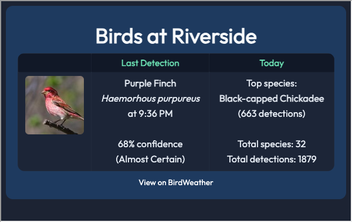

# BirdWeather PUC — Hubitat Driver

By [Brent Rossow](https://github.com/brossow). Integrates your [BirdWeather PUC](https://www.birdweather.com) station with Hubitat Elevation, exposing live bird detections as device attributes and events for use in automations and dashboards.

> **You don't even need your own station** — the driver works with any public BirdWeather station. Browse the map at [app.birdweather.com](https://app.birdweather.com) to find one near you.

## Installation

1. In Hubitat, go to **Drivers Code → New Driver**
2. Paste the contents of `birdweather-puc.groovy` and click **Save**
3. Go to **Devices → Add Device → Virtual**, name it (e.g. "Backyard Birds"), and select **BirdWeather PUC** as the driver
4. Open the device and enter your **Station ID** in Preferences → **Save Preferences**
5. Click **Refresh** once to verify the connection — scheduled polling starts automatically

### Finding Your Station ID

Your Station ID is the number in the URL when viewing your station at [app.birdweather.com](https://app.birdweather.com) — e.g. `app.birdweather.com/stations/12345` → Station ID is `12345`. You can also find it in the BirdWeather app under your station's settings. Pasting the whole station link works too; the driver keeps just the number.

You don't need to use your own station — any public BirdWeather station works. Follow a local nature center, a favorite birding spot, or just the most active station in your area.

### API Token (optional)

The longer API Token shown under Advanced Settings in the BirdWeather app is only needed for **private stations**. Leave it blank for public stations. For a private station, enter the Station ID as usual and add the token: the driver then reads the station through the token, which is how the BirdWeather API serves a private station.

## Attributes

| Attribute | Description |
|-----------|-------------|
| `lastSpecies` | Common name of the most recently detected bird |
| `lastSpeciesScientific` | Scientific name |
| `lastConfidence` | Detection confidence (0–100 %) |
| `lastCertainty` | `Almost Certain` / `Very Likely` / `Uncertain` / `Unlikely` |
| `lastDetectedAt` | ISO 8601 timestamp of the detection |
| `lastDetectedTime` | Display-friendly local time of the detection (e.g. `10:47 AM`) |
| `lastSpeciesImageUrl` | Thumbnail URL for the species |
| `lastSoundscapeUrl` | URL of the audio clip that triggered the detection |
| `recentDetections` | JSON array of the last N detections (configurable) |
| `todaySpeciesList` | JSON array of all species names detected today |
| `todaySpecies` | Number of unique species detected today |
| `todayDetections` | Total detection count today |
| `topSpeciesToday` | Most-detected species today |
| `topSpeciesCount` | Detection count for the top species |
| `lifetimeSpecies` | All-time unique species count (sourced from BirdWeather API) |
| `lifetimeDetections` | All-time total detection count (sourced from BirdWeather API) |
| `lifetimeSpeciesList` | JSON array of all species ever detected, sorted alphabetically |
| `birdDetected` | Trigger attribute — updates on every new detection |
| `newSpeciesDetected` | Trigger attribute — updates when a species is first seen today |
| `newLifetimeSpeciesDetected` | Trigger attribute — updates when a species is detected for the first time ever |
| `driverVersion` | Installed driver version |
| `lastPollStatus` | `OK` or an error message |
| `lastPollTime` | Timestamp of the last successful poll |
| `healthStatus` | `online`, or `offline` once a poll and its retry a minute later have both failed |

## Events

Three events fire in the device event log and can be used as Rule Machine triggers:

- **`birdDetected`** — fires on every new detection; `value` = common name  
  `descriptionText` example: *American Robin detected (94%, almost_certain)*
- **`newSpeciesDetected`** — fires the first time a species is seen each day; `value` = common name  
  `descriptionText` example: *First American Robin sighting today! (Turdus migratorius)*
- **`newLifetimeSpeciesDetected`** — fires the first time a species is ever detected at your station; `value` = common name  
  `descriptionText` example: *New lifetime species: American Robin (Turdus migratorius)*

Each poll reads every detection since the last one, however many there are, so a first sighting isn't missed on a busy station or after the hub was down. After a long gap `birdDetected` fires only for the 10 newest, so a backlog doesn't set off a string of announcements; `newSpeciesDetected` and `newLifetimeSpeciesDetected` still consider every detection. The catch-up stops at about 425 detections and logs a warning.

The daily species list resets at midnight in your hub's time zone. The lifetime list does not reset — it is seeded from your station's complete history via the BirdWeather API, so it stays accurate across hub downtime and reboots.

## Commands

| Command | Description |
|---------|-------------|
| **Refresh** | Poll immediately, including a full re-read of the all-time species list |
| **Reset History** | Clear all tracked state and attributes, then re-seed from the API. Lifetime alerts stay suppressed until the all-time list has reloaded, so this won't set off a burst of notifications |

## Preferences

| Setting | Description |
|---------|-------------|
| **Station ID** | Numeric ID from your station's URL at app.birdweather.com |
| **API Token** | Optional — only needed for private stations; enter it along with the Station ID |
| **Poll Interval** | How often to check for new detections (1–30 min) |
| **Recent Detections to Track** | Depth of the `recentDetections` JSON history (3, 5, 10, or 20) |
| **Minimum Confidence %** | Ignore detections below this threshold (0 = accept all) |
| **Fire events only for certainty level ≥** | Filter detection events by BirdWeather's certainty label |
| **Pause polling at night** | Skip polls between sunset and sunrise |
| **Fire birdDetected event on each detection** | Turn off to keep the event log quiet if you aren't triggering on individual detections |
| **Enable Debug Logging** | Verbose logging in the hub's log viewer |

## Automation Ideas

**Announce every detection on a speaker:**
> Rule Machine → Trigger: `birdDetected` changes →  
> Action: Speak "%lastSpecies% detected in the backyard" on [speaker device]

**Push notification for a new species today:**
> Rule Machine → Trigger: `newSpeciesDetected` changes →  
> Action: Send push "New bird today: %value% (%lastSpeciesScientific%)"

**Push notification for a first-ever sighting:**
> Rule Machine → Trigger: `newLifetimeSpeciesDetected` changes →  
> Action: Send push "First ever sighting: %value% (%lastSpeciesScientific%)"

**Flash a light on a rare/high-confidence sighting:**
> Rule Machine → Trigger: `birdDetected` changes  
> Condition: `lastCertainty` = `Almost Certain`  
> Action: Flash [light device] 3 times

**Dashboard tile:**  
Add `lastSpecies`, `todaySpecies`, and `todayDetections` as tiles using the Attribute template. For a richer display — species photo, detection time, and today's stats in a single tile — see [Tile Builder Grid](#tile-builder-grid) below.

## Tile Builder Grid

[Tile Builder](https://community.hubitat.com/t/release-tile-builder-build-beautiful-dashboards/118822) by @garyjmilne can display all of this driver's data in a single rich dashboard tile — species photo, last detection details, and today's summary side by side. The Grid layout (which enables multi-column tiles) requires a license ($12 minimum donation, unlocked in the Tile Builder app).



See the [community forum post](https://community.hubitat.com/t/release-birdweather-puc-driver/163303) for a complete style example including the variable layout, override CSS, and setup notes.

## Known Limitations

- **Catch-up limit:** after a very long gap (more than about 425 detections since the last poll, e.g. a hub that was off for most of a day), the oldest detections are skipped and a warning is logged.
- **Certainty filter and lifetime alerts:** with *Fire events only for certainty level ≥* set above `all`, a first-ever species detected below that level is recorded without an alert, and its later high-certainty sightings won't fire one either. BirdWeather's all-time species list doesn't say how certain each sighting was, so there's no way to tell.

## API Reference

This driver uses the [BirdWeather REST API](https://app.birdweather.com/api/v1). For a private station, `{id}` is the station's API token:

| Endpoint | Used for |
|----------|----------|
| `GET /stations/{id}/detections?limit=25` | Latest detection + recent history |
| `GET /stations/{id}/detections?limit=100&cursor=N` | Catching up when more than 25 detections arrived since the last poll |
| `GET /stations/{id}/stats?period=day` | Today's species and detection counts |
| `GET /stations/{id}/species?period=day&limit=5` | Top species today |
| `GET /stations/{id}/stats?period=all` | All-time species and detection counts |
| `GET /stations/{id}/species?period=all&limit=100&page=N` | All-time species list |

> **Note:** the `/species` endpoint silently caps `limit` at 100 and returns results sorted by detection count, highest first — a larger `limit` is accepted without error but ignored. The driver walks the list with `page` until a short page comes back; requesting it in one batch would quietly truncate to your 100 most-detected species.

## Tests

```sh
tests/run.sh               # everything
tests/run.sh lifetime      # only tests whose name contains "lifetime"
```

The off-hub tests load the driver into a small stand-in for the Hubitat sandbox, with a fake BirdWeather API that pages and caps results the way the real one does, and a clock the tests control. All you need is Java 8 or later; Groovy 2.4.21, the version the hub runs, is downloaded on first use. GitHub Actions runs them on every push that touches this folder.

## License

Licensed under the Apache License, Version 2.0. See [LICENSE](LICENSE).
